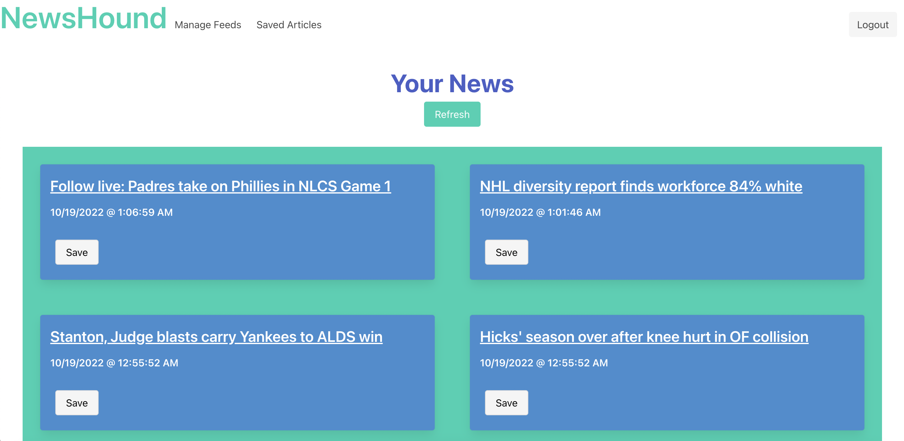

# NewsHound

[Deployed Site](https://serene-plateau-74924.herokuapp.com/)

[View the repo here!](https://github.com/alextheordinary/news-hound)

## Description
The NewsHound application is an application that is used to aggregate news from several RSS feeds that you can choose. Upon signup, you will be redirected to the manage feeds section where you will make your selections. 

Upon saving your choices, you will be redirected to the homepage where you will see articles. From there, you can save articles for future reading, or click on the headline in order to be brough directly to it in another tab. Additionally, there is a "Refresh" button that will refresh the feeds on your homepage, displaying any new articles if the RSS feed has updated.

Along the top of the screen (or in the hamburger menu when on mobile/small screen), you will see the "Saved Articles" option. Your saved choices will be stored there in order to refer back to or "Unsave" in order to remove them from your list.

### Technologies Used
 1. Node.js
 2. Handlebars
 3. RSS Parser (Node module)
 4. Bulma Framework

### Screenshot

